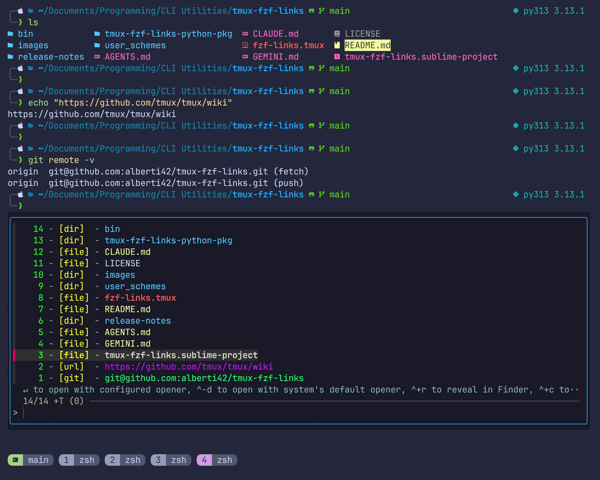

# 🚀 tmux-fzf-links

**tmux-fzf-links** is a versatile tmux plugin that allows you to search for, copy to clipboard, and open links directly from your terminal using fuzzy search powered by [fzf](https://github.com/junegunn/fzf). The plugin supports both default and user-defined schemes, offering unmatched flexibility and integration with tmux popup windows.

The default schemes include recognition of:

- local files with relative and absolute paths (e.g. `~/.zshrc:123` where the optional `:123` specifies the line number)
- Python code error where it recognizes the line at which the error was generated
- web addresses (e.g. `https://...`)
- git addresses (e.g., `git@github.com:alberti42/tmux-fzf-links.git`)
- IPv4 addresses (`192.168.1.42:8000`)

The plugin was originally inspired by [tmux-fzf-url](https://github.com/wfxr/tmux-fzf-url).



---

## 🌟 Features

- **Fuzzy Search Links**: Quickly locate and open links appearing in your terminal output. Support multiple simultaneous choices when pressing `TAB`.
- **Default and Custom Schemes**: Use pre-configured schemes or define your own with custom handlers for pre- and post-processing.
- **Integration with tmux Popup Windows**: Provides a seamless user experience within tmux sessions.
- **Flexible Open Commands**: Configure your favorite editor, browser, or custom command to open links.
- **Dynamic Logging**: Output logs to tmux messages and/or a file, with adjustable verbosity.
- **Colorized Links**: Enhance readability with colorized links, using `$LS_COLORS` for files and directories.
- **Clipboard support**: By pressing `ctrl`-`c`, the selected items are copied to tmux buffer and your system's clipboard, instead of executing the configured actions.
- **Default file association support**: By pressing `ctrl`-`d`, the selected items are opened based on the system's default file association (i.e., using `open` in macOS and `xdg-open` in Linux).
- **File manager support**: By pressing `ctrl`-`r`, the selected items are revealed using the system's default file manager (`open` in macOS and `xdg-open` in Linux).
- **Fast startup**: The plugin bootstraps in ~15 ms, mostly limited by the unavoidable round-trips to the tmux server.

### 🧩 Extensibility

The plugin's Python-based architecture enables advanced users to:

1. Define intricate regular expressions.
2. Implement pre- and post-processing functions for custom behaviors.
3. Extend functionality without modifying the core code.


### 🛠️ Requirements

This plugin is designed to have minimum requirements, only tmux and python3. It does not require special python modules to work. It has been successfully tested with:

- tmux from 3.4 to 3.5
- python from 3.10 to 3.13

It should be possible to ensure backward compatibility with minimum changes, but has to be tested. Please open an [issue](https://github.com/alberti42/tmux-fzf-links/issues) if you encounter issues of back compatibility.

---

## 🎥 Screencast

Watch the plugin in action to see how it enhances your tmux workflow!

<https://github.com/user-attachments/assets/01509743-4ae6-4916-91a0-372bec200ed1>

---

## 📦 Installation

### Using TPM (Tmux Plugin Manager)

To install the plugin with [TPM](https://github.com/tmux-plugins/tpm), add the following lines to your `.tmux.conf`:

```tmux
# List of plugins
set -g @plugin 'alberti42/tmux-fzf-links'
set -g @plugin 'tmux-plugins/tpm'

run '~/.tmux/plugins/tpm/tpm'
```

After adding the configuration, reload your tmux environment:

```bash
tmux source-file ~/.tmux.conf
```
(or `~/.config/tmux/tmux.conf` depending on your setup)

Then install the plugin by pressing:

```plaintext
prefix + I
```

After installation, the `.tmux` file will be located at:

```plaintext
$HOME/.tmux/plugins/tmux-fzf-links/fzf-links.tmux
```

### Using zinit

To install the plugin with [zinit](https://github.com/zdharma-continuum/zinit), add the following to your `.zshrc`:

```zsh
zinit lucid wait as'null' nocompile'!' from'gh-r' id-as'tmux-plugins/tmux-fzf-links' extract'!' @alberti42/tmux-fzf-links
```

This configuration downloads the plugin from GitHub Releases (no git clone required) and loads it with the turbo (delayed) option (`wait`) for optimized shell startup. After installation, the `.tmux` file `fzf-links.tmux` will be located at:

```plaintext
$ZINIT_HOME/plugins/tmux-plugins---tmux-fzf-links/fzf-links.tmux
```

### Manual Installation

To manually install the plugin, clone the repository into a standard directory such as `$HOME/.tmux/plugins/`. Use the following command:

```sh
git clone --depth=1 https://github.com/alberti42/tmux-fzf-links.git ~/.tmux/plugins/tmux-fzf-links
```

Using `--depth=1` ensures only the latest commit is downloaded, minimizing unnecessary download of the commit history. After installation, the `.tmux` file will be located at:

```plaintext
$HOME/.tmux/plugins/tmux-fzf-links/fzf-links.tmux
```

### Starting the Plugin

If you did not use TPM, but did a manual installation or used zinit, ensure the plugin is loaded in your `.tmux.conf`. After installing it, add the following line to your `.tmux.conf`:

```tmux
run-shell "~/.tmux/plugins/tmux-fzf-links/fzf-links.tmux"
```

or, if you used zinit,

```tmux
run-shell "$ZINIT_HOME/plugins/tmux-plugins---tmux-fzf-links/fzf-links.tmux"
```

replacing `$ZINIT_HOME` with the actual value of your zinit home directory.

---

## ⚙️ Configuration

Default options are already provided. However, you can customize all options by adding the following lines to your `.tmux.conf`:

```tmux
# === tmux-fzf-links ===
# set-option -g @fzf-links-key C-h
# set-option -g @fzf-links-history-lines "0"
set-option -g @fzf-links-editor-open-cmd "tmux new-window -n 'emacs' /usr/local/bin/emacs +%line '%file'"
set-option -g @fzf-links-browser-open-cmd "/path/to/browser '%url'"
# set-option -g @fzf-links-fzf-path "fzf"
set-option -g @fzf-links-fzf-display-options "-w 100% --maxnum-displayed 20 --multi --track --no-preview"
# set-option -g @fzf-links-path-extension "/usr/local/bin"
# set-option -g @fzf-links-loglevel-tmux "WARNING"
# set-option -g @fzf-links-loglevel-file "DEBUG"
# set-option -g @fzf-links-log-filename "~/tmux-fzf-links.log"
set-option -g @fzf-links-python "python3"
# set-option -g @fzf-links-python-path "~/.virtualenvs/my_special_venv/lib/python3.11/site-packages"
# set-option -g @fzf-links-user-schemes-path "~/.tmux/plugins/tmux-fzf-links/user_schemes/user_schemes.py"
set-option -g @fzf-links-use-colors on
# set-option -g @fzf-links-ls-colors-filename "~/.cache/tmux-fzf-links/cached_ls_colors.txt"
set-option -g @fzf-links-hide-bottom-bar off

run-shell "~/.local/share/tmux-fzf-links/fzf-links.tmux"
```

Comment out the options you find useful and replace the placeholders with appropriate paths and commands for your environment.

### Notes

1. **`@fzf-links-editor-open-cmd`**: This option specifies the command for opening the editor. In the command, the placeholders `%file` and `%line` are automatically replaced with the fully-resolved file path and the line number, respectively. Note that in general editors have  different syntax to specify how to open a file at a given line.

  To open a terminal-based editor, such as Emacs or Vim, use `tmux new-window` to ensure the editor opens in a new tmux window. Example:  
  ```tmux
  set-option -g @fzf-links-editor-open-cmd "tmux new-window -n 'emacs' /usr/local/bin/emacs +%line '%file'"
  ```

  Alternatively, you can open Emacs or Vim in the same tmux window from where you called the script by using a tmux popup window. Example:
  ```tmux
  set-option -g @fzf-links-editor-open-cmd "tmux popup -E -w 100% -h 100% /usr/local/bin/emacs +%line '%file'"
  ```
  You can customize the size of the popup window by choosing a different value than 100% (`-w`) for the width and height (`-h`).

  For desktop applications, such as Sublime Text, you can directly provide the path to the editor. Example:  
  ```tmux
  set-option -g @fzf-links-editor-open-cmd '/Applications/Sublime Text.app/Contents/SharedSupport/bin/subl'
  ```

  If your $EDITOR variable is already configured before you start tmux server, then you could also use to define `@fzf-links-editor-open-cmd`:
	```tmux
	set-option -g @fzf-links-editor-open-cmd "$EDITOR '%file':%line"
	```
  However, keep in mind that different editors use different syntaxes to designate the line number; thus, adjust the example as it fits to your editor.

  The `$PATH` and all environment variables available to the plugin are those inherited by the tmux **server** at the time it was started — not the current shell's environment. If a tool (editor, browser, `fzf`, `python3`) is not found, either use its full absolute path in the option value, or ensure it is in `$PATH` before starting tmux. Changes made inside a running shell session (e.g. via `.zshrc` modifications or `export` commands) will not be visible to the plugin unless tmux is restarted or the variable is explicitly added with `tmux set-environment`.

	If you prefer to maintain a single configuration file `.tmux.conf` across different platforms, you can use a conditional statement as in the example below. This sets both the editor and browser commands with a single OS check:
	```tmux
	if-shell '[ "$(uname -s)" = "Darwin" ]' {
	  # macOS
	  set-option -g @fzf-links-editor-open-cmd "open vscode://file'%file':%line"
	  set-option -g @fzf-links-browser-open-cmd "open '%url'"
	}{
	  # Linux and others
	  set-option -g @fzf-links-editor-open-cmd "tmux new-window -n 'emacs' /usr/bin/emacsclient -nw -c +%line '%file'"
	  set-option -g @fzf-links-browser-open-cmd "xdg-open '%url'"
	}
	```
	If `$OSTYPE` is exported in your environment (e.g., you start `tmux` from a bash or zsh shell), you can replace the test `[ "$(uname -s)" = "Darwin" ]` with `case "$OSTYPE" in darwin*) true;; *) false;; esac` to avoid executing `uname -s` in a subshell.

  Default setting: `tmux new-window -n 'vim' vim +%line '%file'`

2. **`@fzf-links-browser-open-cmd`**: This option specifies the command for opening the browser. Use `%url` as the placeholder for the URL to be opened. See the cross-platform example in note 1 above for configuring this option across different platforms.

	Default setting: `open '%url'` on macOS, `xdg-open '%url'` on Linux and others

3. **`@fzf-links-fzf-path`**: This option specifies the path to `fzf` command. It is only useful when `fzf` is not directly available in the $PATH.

	Default setting: `fzf`

4. **`@fzf-links-fzf-display-options`**: This option specifies the arguments passed to `fzf`. Refer to the man page of [`fzf`](https://github.com/junegunn/fzf#options) for detailed documentation of the available arguments. In addition to the fzf arguments, this option can contain additional argument, which are specific to this plugin and documented below:

	- **`-h`**: A custom option added by this plugin to set the height in number of lines of the tmux popup. The argument can be a positive integer or a percentage of tmux pane height. For example: `-h 30` means that a panel hosting up to 30 matches will be shown. The extra lines consumed by the border are not accounted for by this option.

 	- **Automatic Height Calculation**: If `-h` (height) is not specified in the options, the plugin dynamically computes the necessary popup height to fit all matches.

  	- **`-w`**: A custom option added by this plugin to set the width in number of characters of the tmux popup, without accounting for the 2 characters consumed by the borders. The argument can be a positive integer or a percentage of tmux pane width.

 	- **`-x`**: A custom option added by this plugin to set the horizontal offset in number of characters of the tmux popup. This option must be a positive integer.

 	- **`-y`**: A custom option added by this plugin to set the vertical offset in number of characters of the tmux popup. This option must be a positive integer.

   	- **`--maxnum-displayed`**: A custom option added by this plugin to limit the maximum number of matches displayed in the `fzf` popup. If the total matches exceed this number, the plugin ensures that only up to `--maxnum-displayed` matches are shown. This is particularly helpful for avoiding oversized popups when many matches are present. 

   Default setting: `-w 100% --maxnum-displayed 15 --multi --track --no-preview`

   This option is read at runtime on every key press, so changes take effect immediately — no need to re-source your tmux config. This means you can update it programmatically mid-session, for example to switch between dark and light `fzf` color schemes when your OS appearance changes.

5. **`@fzf-links-history-lines`**: An integer number determining how many extra lines of history to consider.

	Default setting: `0`

6. **`@fzf-links-ls-colors-filename`**: A file containing the content of $LS_COLORS. For example, you can save $LS_COLORS to a cached file using:
	 ```bash
	 printenv LS_COLORS > cached_ls_colors.txt
	 ```

	 Using such a file is not strictly necessary if `$LS_COLORS` is available in the environment. Use `@fzf-links-ls-colors-filename` only if `tmux` is launched directly as the first process in the terminal, bypassing the shell initialization where `$LS_COLORS` is set.

	Default setting: `""`

7. **`@fzf-links-path-extension`**: This option is also not strictly necessary. It is only required if `fzf-tmux` or `tmux` binaries are not in the `$PATH` that was available when `tmux` started. The plugin only requires these two processes.
    
   Default setting: `""`

8. **`@fzf-links-python`** and **`@fzf-links-python-path`**: These two options allow specifying the path to the Python interpreter and, if needed, to a Python `site-packages` directory, which is appended to `$PYTHONPATH`. The plugin does not rely on any external dependencies. However, you may want to import external modules installed in `site-packages` to extend the functionality of the plugin in `user_schemes`.

   Default setting: `""`

9. 🔍 **Logging**: Control logging levels via these options:

   - `@fzf-links-loglevel-tmux`: Adjust tmux log verbosity (`DEBUG`, `INFO`, `WARNING`, `ERROR`). Default: `WARNING`
   - `@fzf-links-loglevel-file`: Set log verbosity for file logs. Default: `DEBUG`
   - `@fzf-links-log-filename`: Specify the log file location. Omit this property or set it to an empty string to prevent logging to file. Default: `""`

10. **`@fzf-links-hide-bottom-bar`**: Hide the bottom bar with the instructions (`on` or `off`). Default: `off`.

11. **Path expansion in option values**: tmux expands environment variables (e.g., `$HOME`, `$XDG_CONFIG_HOME`) when loading `tmux.conf`, so you can use them freely in any path-based option. The plugin additionally expands a leading `~/` for the options it processes. Both forms are therefore equivalent:
    ```tmux
    set-option -g @fzf-links-log-filename "$HOME/.cache/tmux-fzf-links/fzf-links.log"
    set-option -g @fzf-links-log-filename "~/.cache/tmux-fzf-links/fzf-links.log"
    ```

### Tmux popup borders

By design, the tmux popup is shown with a border around it. We suggest customizing its appearance by adding to your `.tmux.conf`:

```tmux
set-option -g popup-border-lines rounded
set-option -g popup-style "bg=#24273a,fg=#cad3f5"
set-option -g popup-border-style "bg=#24273a,fg=#00bbff"
```

Adjust the colors as you like them. Also, if you use customization themes, make sure to add these commands after the customization theme in your tmux, or else these settings will likely be overwritten by your theme.

### Dynamic appearance switching

Because `@fzf-links-fzf-display-options` is read at runtime (every time tmux-fzf-links is triggered), you can change it at any point during a tmux session and the next invocation of the plugin will pick up the new value automatically — no re-sourcing required.

This pairs naturally with [zsh-appearance-control](https://github.com/alberti42/zsh-appearance-control), a zsh plugin that detects OS-level dark/light mode transitions and dispatches user-defined callbacks. The right hook for updating a tmux option is `ZAC_IO_CMD`: it runs once per appearance change, in the dispatcher, before any shell is signaled — exactly the right place for global I/O like `tmux set-option`.

Create a small executable script, for example `~/.config/zac/io-cmd`:

```zsh
#!/bin/zsh
is_dark=$1
if (( is_dark )); then
    tmux set-option -g @fzf-links-fzf-display-options \
        "-w 100% --maxnum-displayed 20 --multi --track --no-preview --color=dark"
else
    tmux set-option -g @fzf-links-fzf-display-options \
        "-w 100% --maxnum-displayed 20 --multi --track --no-preview --color=light"
fi
```

Make it executable (`chmod +x ~/.config/zac/io-cmd`) and point `ZAC_IO_CMD` to it in your `.zshrc`:

```zsh
export ZAC_IO_CMD=~/.config/zac/io-cmd
```

With this setup, every time your OS (macOS or Linux) switches between dark and light mode, `zsh-appearance-control` runs the script once, the tmux option is updated, and the next time you open the fzf picker it will use the correct color scheme — with no manual intervention needed.

---

## 🖱️ Usage

1. Start tmux.
2. Press `<prefix>` + the configured key (default: `C-h`; an easy-to-type key sequence; you can change it) to activate **tmux-fzf-links**.
3. Select a link using the fuzzy search interface.
4. Press `TAB` or `SHIFT-TAB` to select or deselect multiple choices
4. The selected links will be opened using the configured command (editor, browser, or custom).

---

## 🛠️ Defining Schemes for Power Users

### Default Schemes

The plugin uses a **list of dictionaries** to define schemes, where each dictionary represents a single scheme. Each scheme includes the following fields:

- **`tags`**: A tuple of strings representing the possible tags for the scheme. Tags serve two purposes:
  1. **User hints**: Displayed in the fzf interface to help users understand the type of link.
  2. **Post-processing rules**: Used internally by the plugin to determine the appropriate action based on the selected tag.
- **`opener`**: Specifies the application or process used to open the link (e.g., a browser, editor, or custom process).
- **`regex`**: A list of regular expressions matching the target patterns. For most applications, a single regex is sufficient. Use multiple regex to match alternatives.
- **`pre_handler`**: A function that processes the match and returns a dictionary containing:
  - `display_text`: The text displayed in the fzf interface.
  - `tag`: One of the tags defined in `tags`.
  If the match is invalid or false-positive, the `pre_handler` can return `None` to drop the match.
- **`post_handler`**: A function that determines the command to execute for the selected link.

```python
default_schemes = [
    {
        "tags": ("url",),
        "opener": OpenerType.BROWSER,
        "regex": [re.compile(r"https?://(?:www\.)?[-a-zA-Z0-9@:%._\+~#=]{1,256}\.[a-zA-Z0-9()]{1,6}\b[-a-zA-Z0-9()@:%_\+.~#?&//=]*")],
        "pre_handler": lambda m: {
            "display_text": f"{colors.rgb_color(200,0,255)}{m.group(0)}{colors.reset_color}",
            "tag": "url"
        },
        "post_handler": None,
    },
    {
        "tags": ("file", "dir"),
        "opener": OpenerType.CUSTOM_OPEN,
        "regex": [
            re.compile(r"(?P<link>^[^<>:\"\\|?*\x00-\x1F]+)(\:(?P<line>\d+))?",re.MULTILINE), # filename with spaces, starting at the line beginning
            re.compile(r"\'(?P<link>[^:\'\"|?*\x00-\x1F]+)\'(\:(?P<line>\d+))?"), # filename with spaces, quoted
            re.compile(r"(?P<link>[^\ :\'\"|?*\x00-\x1F]+)(\:(?P<line>\d+))?"), # filename not including spaces
        ],
        "pre_handler": file_pre_handler,
        "post_handler": file_post_handler,
    },
]
```

### Adding User-Defined Schemes

You can define additional schemes in a file such as `user_schemes.py`. Specify the path to your `user_schemes.py` file in your `.tmux.conf` configuration.

#### Customizing Pre-Handlers

The `pre_handler` processes matches before they are displayed in the fzf interface. It must return a dictionary with:

- **`display_text`**: A string containing the formatted text for fzf, including colors if configured.
- **`tag`**: A string that must be one of the scheme's `tags`.

##### Dropping False Positives

To handle false positives, the `pre_handler` can return `None`. For example:

```python
def code_error_pre_handler(match: re.Match[str]) -> PreHandledMatch | None:
    resolved_path = heuristic_find_file(match.group("file"))
    if resolved_path is None:
        return None  # Drop the match if the file cannot be resolved

    return {
        "display_text": f"{colors.rgb_color(255,0,0)}{match.group('file')}, line {match.group('line')}{colors.reset_color}",
        "tag": "Python",
    }
```
In this example, matches are dropped if the file path cannot be resolved.

##### Dynamic Tag Assignment

Dynamic tag assignment allows `pre_handler` to adjust tags based on the match content. For example:

- Python vs. generic coding errors:
  ```python
  resolved_path = heuristic_find_file(match.group("file"))
  suffix = resolved_path.suffix
  tag = "Python" if suffix == ".py" else "code err."
  ```

- Files vs. directories:
  ```python
  tag = "dir" if resolved_path.is_dir() else "file"
  ```

#### Customizing Post-Handlers

The `post_handler` function returns a dictionary containing instructions on what to do with the selected link. Depending on how the `opener` is configured, the dictionary must specify different information:

- For `OpenerType.EDITOR`, the dictionary must include:
  - **`file`**: The fully-resolved file path.
  - **`line`** (optional): The line number to open in the editor.
- For `OpenerType.BROWSER`, the dictionary must include:
  - **`url`**: The URL to open in the browser.
- For `OpenerType.CUSTOM_OPEN`, the dictionary contains:
  - **`cmd`**: The path to the custom opener executable.
  - **`args`**: The arguments in the form of a list to be provided to the specified command.
  - **`file`**: An optional field specifying the path to the file whenever a file can be associated with the selected choice. This is used to open the file with the system's default file association and to reveal the file in the system's default file manager.
- For `OpenerType.REVEAL` and `OpenerType.SYSTEM_OPEN`, the dictionary must include:
  - **`file`**: The fully-resolved file path. The file is either revealed in the system's default file manager or opened with the system's default file association for the two openers, respectively.

##### Example: Handling URLs

For a browser opener (`OpenerType.BROWSER`), the `post_handler` can return a dictionary with the `url` field:

```python
def ip_post_handler(match: re.Match[str]) -> PostHandledMatch:
    ip_addr_str = match.group("ip")
    return {"url": f"https://{ip_addr_str}"}
```

The corresponding scheme:

```python
ip_scheme: SchemeEntry = {
    "tags": ("IPv4",),
    "opener": OpenerType.BROWSER,
    "regex": [re.compile(r"(?<!://)(?P<ip>\b(?:\d{1,3}\.){3}\d{1,3}\b(:\d+)?)")],
    "pre_handler": lambda m: {
        "display_text": m.group("ip"),
        "tag": "IPv4"
    },
    "post_handler": ip_post_handler,
}
```

##### Example: Handling Code Errors

For an editor opener (`OpenerType.EDITOR`), the `post_handler` can return a dictionary with the `file` and `line` fields:

```python
def code_error_post_handler(match: re.Match[str]) -> PostHandledMatch:
    file = match.group("file")
    line = match.group("line")

    resolved_path = heuristic_find_file(file)
    if resolved_path is None:
        raise FailedResolvePath(f"Could not resolve the path of: {file}")

    return {"file": str(resolved_path.resolve()), "line": line}
```

The corresponding scheme:

```python
code_error_scheme: SchemeEntry = {
    "tags": ("code err.", "Python"),
    "opener": OpenerType.EDITOR,
    "regex": [re.compile(r"File \"(?P<file>...*?)\"\, line (?P<line>[0-9]+)")],
    "pre_handler": code_error_pre_handler,
    "post_handler": code_error_post_handler,
}
```

##### Example: Handling Files and Directories

For a custom opener (`OpenerType.CUSTOM_OPEN`), the `post_handler` returns a list of arguments directly passed to `subprocess.Popen`. The first element specifies the custom opener executable:

```python
def file_post_handler(match: re.Match[str]) -> list[str]:
    file_path_str = match.group("link1") or match.group("link2")
    resolved_path = heuristic_find_file(file_path_str)

    if resolved_path is None:
        raise FailedResolvePath(f"Could not resolve the path of: {file_path_str}")

    resolved_path_str = str(resolved_path.resolve())

    if resolved_path.is_file():
        # Use a configured editor to open the file
        return shlex.split(configs.editor_open_cmd.replace("%file", resolved_path_str).replace("%line", "1"))
    else:
        # Open the directory in Finder (macOS), Nautilus (Linux), or Explorer (Windows)
        if sys.platform == "darwin":
            return ["open", "-R", resolved_path_str]
        elif sys.platform == "linux":
            return ["xdg-open", resolved_path_str]
        elif sys.platform == "win32":
            return ["explorer", resolved_path_str]
        else:
            raise NotSupportedPlatform(f"Platform {sys.platform} not supported")
```

The corresponding scheme:

```python
file_scheme: SchemeEntry = {
    "tags": ("file", "dir"),
    "opener": OpenerType.CUSTOM_OPEN,
    "regex": [
            re.compile(r"(?P<link>^[^<>:\"\\|?*\x00-\x1F]+)(\:(?P<line>\d+))?",re.MULTILINE), # filename with spaces, starting at the line beginning
            re.compile(r"\'(?P<link>[^:\'\"|?*\x00-\x1F]+)\'(\:(?P<line>\d+))?"), # filename with spaces, quoted
            re.compile(r"(?P<link>[^\ :\'\"|?*\x00-\x1F]+)(\:(?P<line>\d+))?"), # filename not including spaces
    ],
    "pre_handler": file_pre_handler,
    "post_handler": file_post_handler,
}
```

#### Overwriting Default Schemes

You can overwrite existing default schemes by defining a new scheme in `user_schemes.py` with at least one of the tags used in the default scheme. The plugin gives precedence to user-defined schemes over default ones.

#### Disabling Default Schemes

You can disable specific default schemes by populating the `rm_default_schemes` list in your `user_schemes.py` file. For example:

```python
# Remove default schemes (e.g., ["file"] to remove tag "file")
rm_default_schemes: list[str] = ["file", "dir"]
```

When you add a tag to `rm_default_schemes`, all schemes associated with that tag will be disabled. If a scheme has multiple tags, specifying any one of them will disable the entire scheme. **It is not possible to disable just one tag from a multi-tag scheme while keeping other tags active.**

---

## 🔍 Troubleshooting

If the plugin is not working as expected, follow these steps to diagnose the issue:

### 1. Enable Logging
The most effective way to debug is to enable file logging. Add these to your `.tmux.conf`:
```tmux
set-option -g @fzf-links-loglevel-file "DEBUG"
set-option -g @fzf-links-log-filename "~/tmux-fzf-links.log"
```
Reload tmux by sourcing your configuration file:
```bash
tmux source-file ~/.tmux.conf
```
(or `~/.config/tmux/tmux.conf` depending on your setup) and check the log file after attempting to use the plugin.

### 2. Common Issues
- **fzf popup height too small**: If the fzf popup cuts off items at the bottom, you likely have a `--border` option in `@fzf-links-fzf-display-options`. This commonly happens when the option is populated from `$FZF_DEFAULT_OPTS` without cleaning it up. Each fzf-level border consumes 2 extra lines that the plugin does not account for — `--border=none` is the fzf default and the right choice here, since the tmux popup already provides a border. If you populate `@fzf-links-fzf-display-options` from `$FZF_DEFAULT_OPTS` (for example inside a `ZAC_IO_CMD` script), strip the border option first:
  ```zsh
  "$(printf '%s' "$FZF_DEFAULT_OPTS" | sed -E 's/--border(=[^[:space:]]+)?[[:space:]]*//g')"
  ```
- **`$PATH` and environment variables**: The plugin inherits the environment of the tmux **server** process, which is fixed at the time tmux was started. Any `export` commands or shell initializations (e.g. `.zshrc`) run after tmux starts are not visible to the plugin. If a command is not found, use its full absolute path in the relevant option, or restart tmux after updating your environment. You can also inject a variable into the running tmux environment with `tmux set-environment`.
- **`python3` or `fzf` not found**: Ensure these are in your `$PATH` at the time tmux starts. If they are installed in non-standard locations, set them explicitly:
  ```tmux
  set-option -g @fzf-links-python "/path/to/python3"
  set-option -g @fzf-links-fzf-path "/path/to/fzf"
  ```
- **Path expansion**: tmux expands environment variables such as `$HOME` in option values when loading `tmux.conf`. The plugin additionally expands a leading `~/` at runtime. Both `$HOME/...` and `~/...` are therefore valid in any path-based option. See also note 11 in the [Configuration Notes](#notes) section.
- **Silent `tmux new-window` failures**: If your editor fails to open in a new window, it might be because the command provided to `tmux new-window` is incorrect. Since `tmux` reports success as long as it delivers the message to the server, these failures can be silent. Double-check your path and arguments in the log file.

### 3. Performance
The plugin is highly optimized, with a total load time of approximately **11ms** on modern systems. It uses bulk-fetching for tmux options and zero-fork tilde expansion to ensure it doesn't slow down your tmux startup. You can see the load time in the log file if logging is enabled.

---

## 🤝 Contributing

Contributions are welcome! Please fork this repository and submit a pull request for enhancements or bug fixes, or simply report any issues in the [GitHub repository](https://github.com/alberti42/tmux-fzf-links/issues).

---

## ❤️ Donations

I would be grateful for any donation to support the development of this plugin.

[](https://buymeacoffee.com/alberti)

---

## 👨‍💻 Author

- **Author:** Andrea Alberti
- **GitHub Profile:** [alberti42](https://github.com/alberti42)
- **Donations:** [](https://buymeacoffee.com/alberti)

---

## 📜 License

This project is licensed under the MIT License. See the [LICENSE](LICENSE) file for details.
